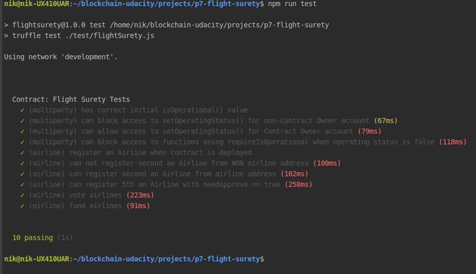

# FlightSurety

FlightSurety is application project for Udacity's Blockchain course.

## Prerequisites

Please make sure you've already installed nodejs version 10+ (tested on v10.15.2), MetaMask extension( with wallet imported from ganache )in your browser.

## Install

This repository contains Smart Contract code in Solidity (using Truffle), tests (also using Truffle), dApp (using HTML, CSS and JS) and server app.

To install, download or clone the repo, then:

`npm install`

## Launch Ganache:
Run this command in separate terminal window

`npx ganache-cli -m "candy maple cake sugar pudding cream honey rich smooth crumble sweet treat" -a 50`

## Run truffle tests:

`npm run test`

Test result:

## Compile and migrate project:
To use the dapp:

`npx truffle compile`

`npx truffle migrate --reset`

## Launch Oracles Server
Run this command in separate terminal window

`npm run server`

## Launch Dapp
Run this command in separate terminal window

`npm run dapp`

To view dapp:

`http://localhost:8000`

## Deploy

To build dapp for prod:
`npm run dapp:prod`

Deploy the contents of the ./dapp folder

## Resources

* [How does Ethereum work anyway?](https://medium.com/@preethikasireddy/how-does-ethereum-work-anyway-22d1df506369)
* [BIP39 Mnemonic Generator](https://iancoleman.io/bip39/)
* [Truffle Framework](http://truffleframework.com/)
* [Ganache Local Blockchain](http://truffleframework.com/ganache/)
* [Remix Solidity IDE](https://remix.ethereum.org/)
* [Solidity Language Reference](http://solidity.readthedocs.io/en/v0.4.24/)
* [Ethereum Blockchain Explorer](https://etherscan.io/)
* [Web3Js Reference](https://github.com/ethereum/wiki/wiki/JavaScript-API)
